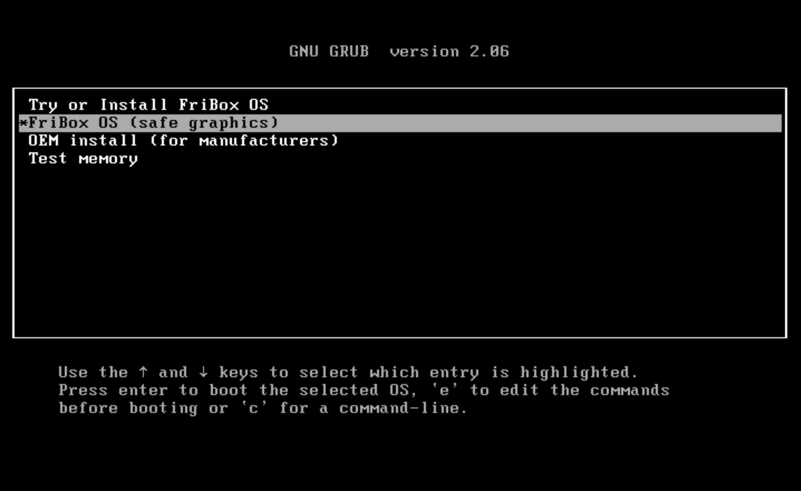
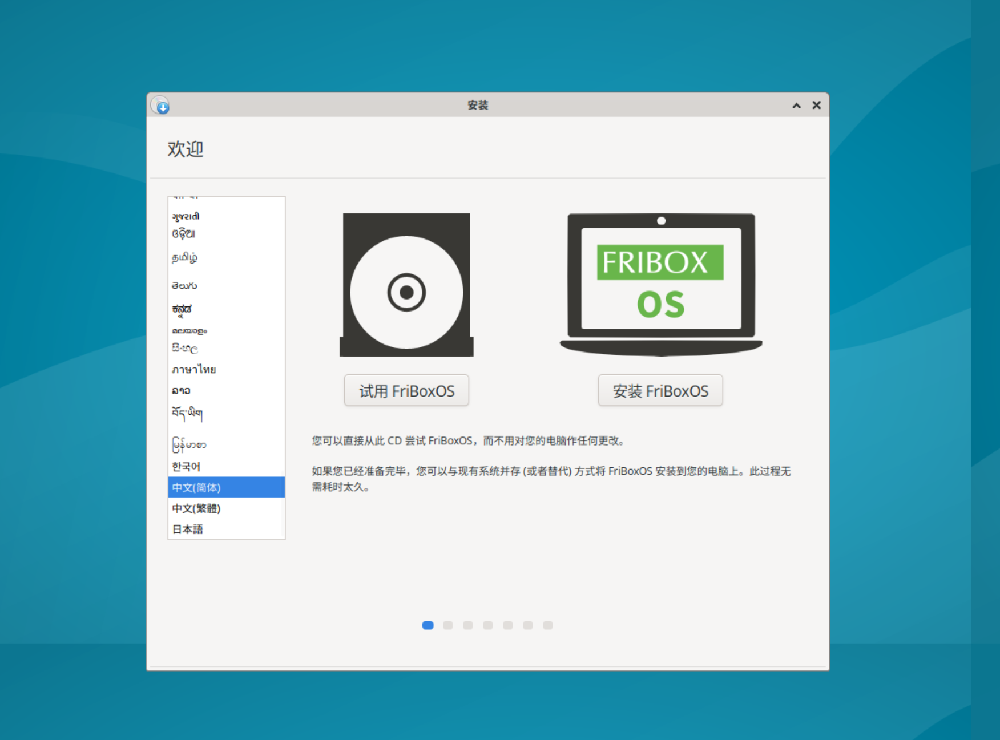
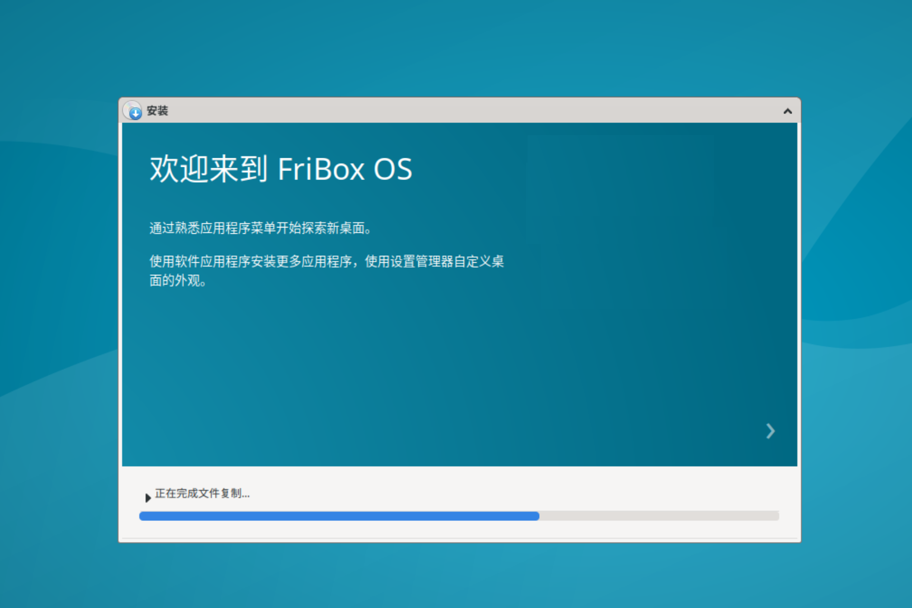
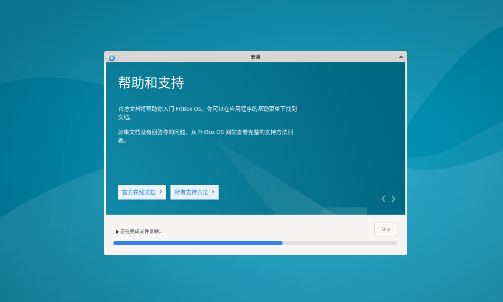
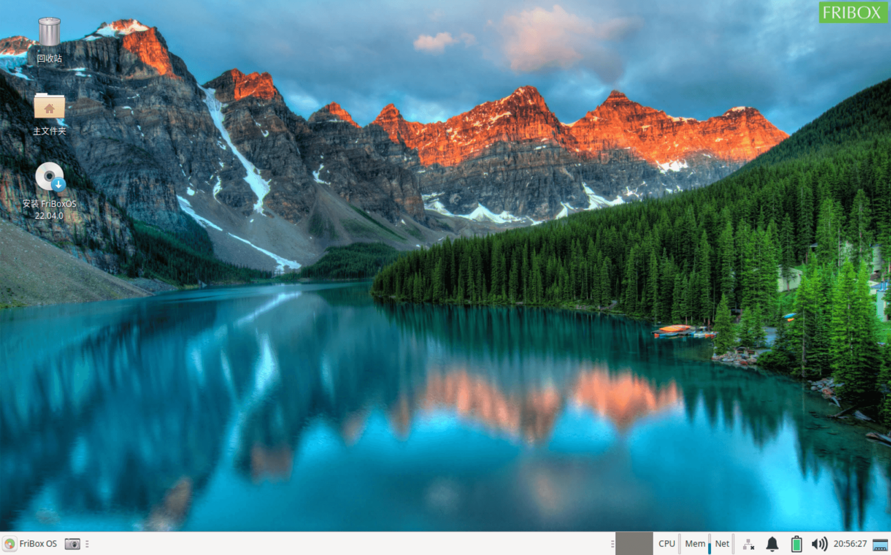

# FriBox OS
FriBox OS ( Custom Xubuntu Distribution ) 
FriBox OS 是基于 Xubuntu 深度定制的派生发行版，使用轻量级桌面环境，并面向低端机器作了优化，致力于快速与低资源消耗，但仍然具有视觉吸引力且易于使用。 
使用xFce作为轻量级桌面环境，使用Firefox和Thunderbird作为默认的网页浏览器和邮件客户端，使用LibreOffice作为默认的文件和表格编辑器； 
对桌面、主题、字体、终端、Thunar文件管理器等多方面进行了深度定制和调优，并预置了多种开源中文字体。 
 
项目相关页面： 
　http://fribox.cn/?p=684 
　https://github.com/FriBox/FriBoxOS 
　https://gitee.com/FriBox-OpenSource/FriBoxOS 
 
FriBox OS v22.04.0 LTS (2022.05.08) 发布： 
　使用2022-04-14发布的Linux 5.15.0-27内核；
 
下载 FriBox OS v22.04.0-2022.05.08（包含ISO文件和VM虚拟机模板文件）： 

 

